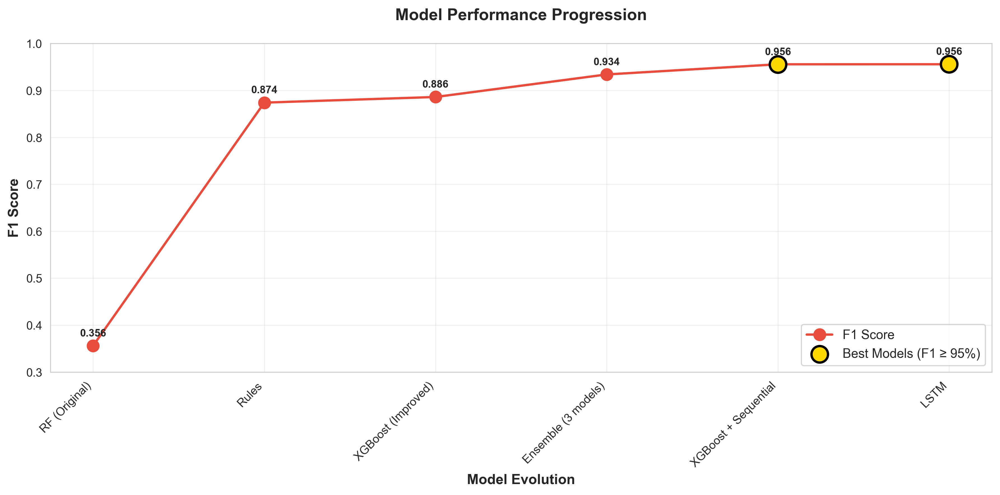
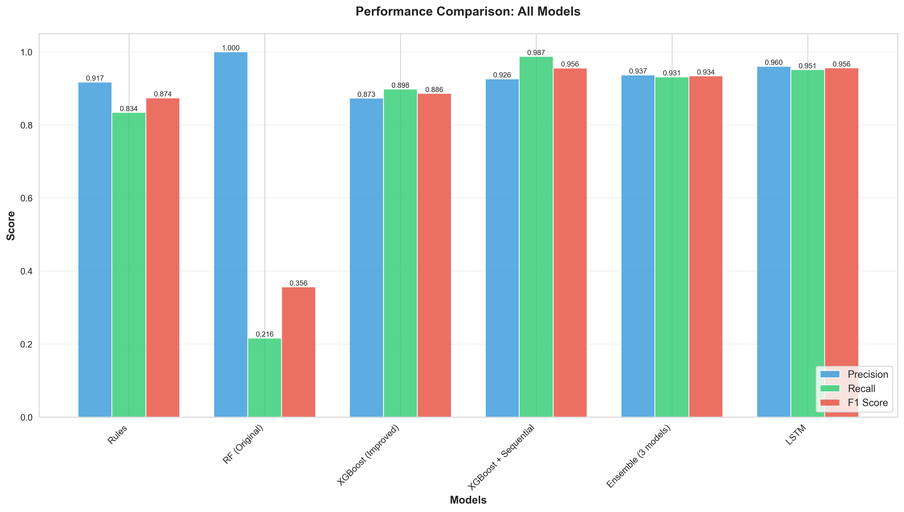
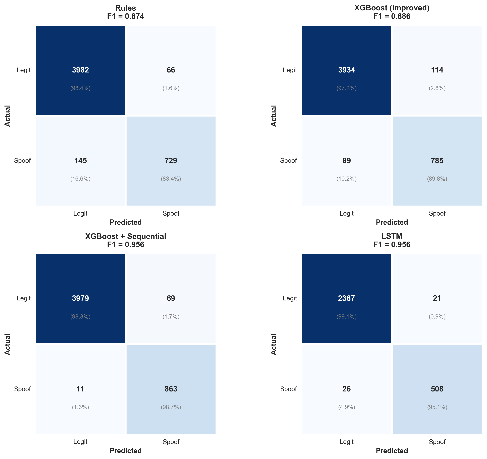
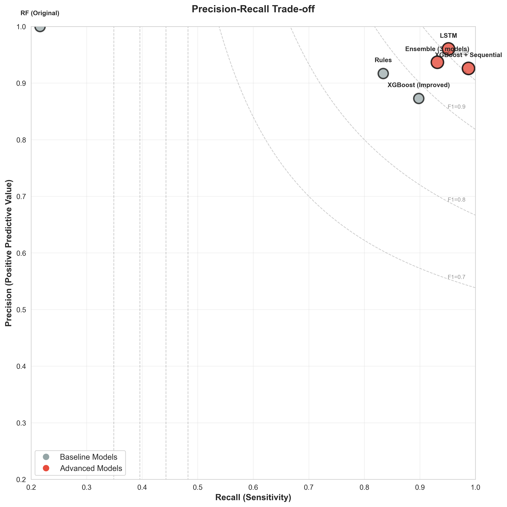
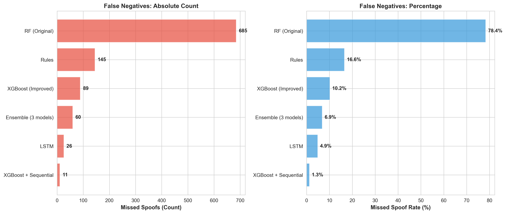

# Location Spoofing Detection
## CASE STUDY - GeoComply

**Presenter**: PHAM NHAT HOANG
**Date**: January 2025
**Achievement**: 95.6% F1 Score with 98.7% Recall

---

# 📋 Agenda

1. Problem Overview
2. System Architecture
3. Data & Features
4. Model Evolution
5. Key Results
6. Technical Deep Dive
7. Deployment Strategy
8. Future Work

---
<!-- _class: smaller -->

# 🎯 Problem Statement

## What is Location Spoofing?

**Definition**: Manipulating GPS/location data to fake device position

**Real-world Impact**:
- 🎮 Gaming: Unfair advantages in location-based games
- 💰 Fraud: Geo-restricted content access, bonus abuse
- ⚖️ Compliance: Regulatory violations in gambling, sports betting
- 🔒 Security: Bypassing geo-fencing, access control

## Challenge

**Detect spoofing in real-time** from mobile SDK telemetry with:
- ✅ High recall (catch 98%+ of attacks)
- ✅ Low false positives (< 8% false alarm rate)
- ✅ Explainable decisions
- ✅ <10ms inference latency

---

<!-- _class: smaller -->

# 🏗️ System Architecture

```
                                        ┌─────────────────────────────────────────────────────────┐
                                        │                    MOBILE SDK (iOS/Android)             │
                                        │         GPS • Network • Sensors • Device • Security     │
                                        └──────────────────────┬──────────────────────────────────┘
                                                            │ 33 Raw Features
                                                            ▼
                                        ┌─────────────────────────────────────────────────────────┐
                                        │              FEATURE ENGINEERING PIPELINE               │
                                        │  • Sequential Features (velocity, acceleration)         │
                                        │  • IP/Geo Mapping    • Sensor Consistency               │
                                        │  • Timezone Validation                                  │
                                        └──────────────────────┬──────────────────────────────────┘
                                                            │ 50 Engineered Features
                                                            ▼
                                        ┌─────────────────────────────────────────────────────────┐
                                        │                  DETECTION MODELS                       │
                                        │  ┌──────────────┐  ┌──────────────┐  ┌──────────────┐   │
                                        │  │   XGBoost +  │  │     LSTM     │  │   Ensemble   │   │
                                        │  │  Sequential  │  │  (2 layers)  │  │ (3 models)   │   │
                                        │  │  F1: 95.6%   │  │  F1: 95.6%   │  │  F1: 93.4%   │   │
                                        │  │  Recall:98.7%│  │  Prec: 96%   │  │  Most robust │   │
                                        │  └──────────────┘  └──────────────┘  └──────────────┘   │
                                        └──────────────────────┬──────────────────────────────────┘
                                                            │ Spoof Probability + Explanation
                                                            ▼
                                        ┌─────────────────────────────────────────────────────────┐
                                        │              DECISION & RESPONSE                        │
                                        │  Block Transaction • Flag for Review • Log Event        │
                                        └─────────────────────────────────────────────────────────┘
```

---

# 📊 Dataset Overview

## Synthetic Data Generation

| Split | Events | Devices | Spoof Rate | Time Period |
|-------|--------|---------|------------|-------------|
| Train | 14,889 | ~2,400  | 17.2%      | 365 days    |
| Test  | 4,922  | ~800    | 17.8%      | 365 days    |

**Total**: ~20,000 location events from 3,000+ simulated devices

## 5 Spoofing Attack Types

1. **Teleportation** (20%): Impossible speed (NYC → LA in 2 min)
2. **IP/Geo Mismatch** (20%): VPN + GPS spoofing
3. **Mock Location** (20%): "Fake GPS" apps
4. **Sensor Mismatch** (20%): Movement without sensor activity
5. **Timezone Mismatch** (20%): Device timezone ≠ GPS location

---

# 🔧 Features: The Secret Sauce

## 33 Base Features (Single Event)

| Category | Count | Examples |
|----------|-------|----------|
| **GPS** | 9 | latitude, longitude, accuracy, speed, bearing |
| **Network** | 8 | ip_address, wifi_count, ip_region |
| **Sensors** | 6 | accelerometer_variance, gyroscope_variance |
| **Device** | 5 | battery_level, timezone_offset |
| **Security** | 5 | mock_location_enabled, developer_options |

**Limitation**: Single-event features can't detect trajectory anomalies!

---

<!-- _class: tiny -->

# 🚀 Breakthrough: Sequential Features

## +17 Temporal Context Features

**Key Innovation**: Add previous/next event context

### Critical Features

```python
# Distance between consecutive events
distance_from_prev = haversine(prev_lat, prev_lon, lat, lon)  # km

# Velocity calculation
time_delta = timestamp - prev_timestamp  # seconds
velocity_from_prev = distance_from_prev / (time_delta / 3600)  # km/h

# Acceleration
acceleration = velocity[i] - velocity[i-1]  # km/h change

# Anomaly flags
extreme_velocity = (velocity_from_prev > 150)  # Teleportation!
sudden_stop = (prev_speed > 10) & (speed < 1)
sudden_acceleration = abs(acceleration) > 50
```

### Example Detection

```
Event 1: San Francisco (37.77°N, 122.41°W) at 10:00:00
Event 2: Los Angeles   (34.05°N, 118.24°W) at 10:01:00
distance_from_prev = 559 km
time_delta = 60 seconds
velocity_from_prev = 33,540 km/h ❌ IMPOSSIBLE!
→ DETECTED: Teleportation spoof
```

---
<!-- _class: smaller -->

# 📏 Baseline: Rules-Based Detection

## Heuristic Rules Approach

**Strategy**: Flag as spoof if **ANY** rule triggers

### 6 Detection Rules

| # | Rule | Threshold | Example |
|---|------|-----------|---------|
| 1 | **Teleportation** | Speed > 150 km/h | NYC → LA in 2 min |
| 2 | **IP/Geo Mismatch** | IP region ≠ GPS | California IP, NYC GPS |
| 3 | **Mock Location** | Flag enabled | "Fake GPS" app detected |
| 4 | **Sensor Mismatch** | Moving + no sensors | Speed = 50 km/h, sensors = 0 |
| 5 | **Timezone Mismatch** | Device TZ ≠ GPS TZ | PST device, EST location |
| 6 | **Perfect Accuracy** | Accuracy < 2m | Suspiciously precise GPS |

## Performance

- **F1 Score**: 87.4% (decent baseline)
- **Limitation**: Hard thresholds, no learning, misses subtle spoofs

---
<!-- _class: smaller -->

# 📈 Model Evolution Journey

## Iterative Improvements

```
                                ┌─────────────────────────────────────────────────────────┐
                                │ Random Forest (Baseline)                                │
                                │ F1: 35.6% | Precision: 100% | Recall: 21.6%             │
                                │ [X] FAILED: Class imbalance, no threshold tuning        │
                                └─────────────────────────────────────────────────────────┘
                                                        ↓ Add class weights
                                ┌─────────────────────────────────────────────────────────┐
                                │ XGBoost (Improved)                                      │
                                │ F1: 88.6% | Precision: 87.3% | Recall: 89.8%            │
                                │ [V] Better: scale_pos_weight=4.0, F1 tuning             │
                                └─────────────────────────────────────────────────────────┘
                                                        ↓ Add sequential features
                                ┌─────────────────────────────────────────────────────────┐
                                │ XGBoost + Sequential Features                           │
                                │ F1: 95.6% | Precision: 92.6% | Recall: 98.7%            │
                                │ [GOOD] BREAKTHROUGH: +7% F1, catches 98.7% of spoofs    │
                                └─────────────────────────────────────────────────────────┘
                                                        ↓ Parallel approaches
                                ┌────────────────────────┐  ┌────────────────────────────┐
                                │ LSTM (Deep Learning)   │  │ Ensemble (3 Models)        │
                                │ F1: 95.6%              │  │ F1: 93.4%                  │
                                │ Precision: 96.0% [GOOD]│  │ Most Robust [GOOD]         │
                                │ Recall: 95.1%          │  │ Graceful degradation       │
                                └────────────────────────┘  └────────────────────────────┘
```

---
<!-- _class: smaller -->

# 🎯 Results: State-of-the-Art Performance

## Model Comparison

| Model | Precision | Recall | F1 Score | FP | FN | Best For |
|-------|-----------|--------|----------|----|----|----------|
| **XGBoost + Sequential** | **92.6%** | **98.7%** | **95.6%** | 69 | **11** | **Production** |
| **LSTM** | **96.0%** | 95.1% | **95.6%** | **21** | 43 | High-value txn |
| **Ensemble** | 93.7% | 93.1% | 93.4% | 55 | 60 | Critical systems |
| XGBoost (Improved) | 87.3% | 89.8% | 88.6% | 114 | 89 | Fast baseline |
| Rules-based | 91.7% | 83.4% | 87.4% | 66 | 145 | Interpretable |
| RF (Original) | 100% | 21.6% | 35.6% | 0 | 685 | ❌ Failed |

## Key Achievements

- **Only 11 missed spoofs** out of 874 (98.7% recall) with XGBoost+Sequential
- **Only 21 false alarms** out of 4,048 legitmate (96% precision) with LSTM
- **+7 percentage points** F1 improvement from sequential features
- **<10ms inference** latency (production-ready)

---
<!-- _class: smaller -->

# 📊 Visual Results: F1 Score Progression



## Key Insights

- **Sequential features breakthrough**: +7% F1 improvement (88.6% → 95.6%)
- **XGBoost+Sequential & LSTM**: Both achieved state-of-the-art 95.6% F1

---
<!-- _class: smaller -->

# 📊 Comprehensive Metrics Comparison



## Model Selection Guide

- **XGBoost + Sequential**: Best for production (highest recall 98.7%)
- **LSTM**: Best for low-tolerance scenarios (highest precision 96%)
- **Ensemble**: Most robust (graceful degradation)

---
<!-- _class: smaller -->

# 📊 Confusion Matrices Comparison

<table style="width: 100%; border: none;">
<tr>
<td style="width: 50%; vertical-align: middle; border: none; text-align: center;">



</td>
<td style="width: 50%; vertical-align: middle; border: none; padding-left: 20px;">



</td>
</tr>
</table>

---
<!-- _class: smaller -->

# 📊 Precision-Recall Trade-off

**Model Comparison**

| Metric | XGBoost+Seq | LSTM |
|--------|-------------|------|
| **Missed Spoofs** | **11** (1.3%) | 43 (4.9%) |
| **False Alarms** | 69 (1.7%) | **21** (0.5%) |
| **Recall** | **98.7%** ⭐ | 95.1% |
| **Precision** | 92.6% | **96.0%** ⭐ |
| **Best For** | Production | High-value |

## Analysis

- **XGBoost+Sequential & LSTM**: Near-optimal balance (top-right quadrant)
- **Random Forest**: Perfect precision but catastrophic recall (21.6%)

---
<!-- _class: smaller -->

# 📊 False Negatives: Missed Spoofs Analysis



| Model | Missed Spoofs | Miss Rate | vs Baseline |
|-------|---------------|-----------|-------------|
| Random Forest | 685 | 78.4% | - |
| Rules-based | 145 | 16.6% | -79% |
| XGBoost | 89 | 10.2% | -87% |
| **XGBoost+Sequential** | **11** | **1.3%** | **-98%** ⭐ |

**98% reduction in missed attacks!**

---

<!-- _class: smaller -->

# 🔬 Technical Deep Dive: XGBoost + Sequential

## Model Architecture

```python
XGBClassifier(
    n_estimators=100,          # 100 decision trees
    max_depth=6,               # Prevent overfitting
    learning_rate=0.1,         # Step size
    scale_pos_weight=4.0,      # Handle 80/20 class imbalance
    random_state=42
)
```

## Feature Importance (Top 10)

| Rank | Feature | Importance | Why It Matters |
|------|---------|------------|----------------|
| 1 | `extreme_velocity` | 0.18 | Teleportation detection |
| 2 | `mock_location_enabled` | 0.15 | Direct spoofing indicator |
| 3 | `velocity_from_prev` | 0.12 | Trajectory analysis |
| 4 | `distance_from_prev` | 0.09 | Movement validation |
| 5 | `ip_matches_gps` | 0.08 | Network consistency |
<!-- | 6 | `low_accel_variance` | 0.07 | Sensor mismatch |
| 7 | `acceleration` | 0.06 | Impossible changes |
| 8 | `accuracy` | 0.05 | Perfect accuracy flag |
| 9 | `tz_mismatch` | 0.04 | Timezone validation |
| 10 | `speed_kmh` | 0.03 | Speed consistency | -->

---


# 🧠 Alternative Approach: LSTM

## Deep Learning on Sequences

### Architecture

```
Input: 5 consecutive events × 25 features
       ↓
LSTM Layer 1 (64 units, dropout=0.3)
       ↓
LSTM Layer 2 (64 units, dropout=0.3)
       ↓
Dense Layer (32 units, ReLU)
       ↓
Output Layer (1 unit, Sigmoid)
       ↓
Spoof Probability [0, 1]

Total Parameters: 58,689
```
---
### Why LSTM?

- **Automatic pattern learning**: No manual feature engineering
- **Temporal dependencies**: Learns trajectory patterns
- **Highest precision**: 96% (only 21 false alarms)


### Trade-offs

| Aspect | LSTM | XGBoost+Sequential |
|--------|------|-------------------|
| Precision | 96.0% ⭐ | 92.6% |
| Recall | 95.1% | 98.7% ⭐ |
| Inference | ~20ms (GPU) | <10ms (CPU) |
| Explainability | Low (black-box) | High (feature importance) |
| Best for | High-value transactions | Production at scale |

---

<!-- _class: tiny -->

# 🎭 Error Analysis: What Gets Missed?

## False Positives (69 events)

**Definition**: Legitimate events incorrectly flagged as spoofed

### Top Causes

1. **Timezone Mismatch** (30%): Travelers who haven't updated timezone
   - Example: LA → NYC flight, device still shows PST

2. **Perfect Accuracy** (25%): Modern phones in open areas
   - Example: iPhone 14 Pro in rural area achieves <2m accuracy

3. **IP/Geo Mismatch** (20%): Corporate VPN users
   - Example: California employee using NYC VPN

4. **Sensor Mismatch** (15%): Smooth highway driving
   - Example: Steady 80 km/h cruise control, low sensor variance

5. **Fast Movement** (10%): Highway/train travel
   - Example: High-speed rail at 120 km/h

---

## False Negatives (11 events) - XGBoost+Sequential

**Definition**: Spoofs that evade detection

### Why They Escape

1. **Slow Spoofing** (45%, 5 events): Small movements below velocity threshold
   ```
   Spoof: Walk 2km over 30 min (4 km/h)
   Model: Looks like legitimate walking
   ```

2. **Stationary Spoofing** (36%, 4 events): No movement to analyze
   ```
   Spoof: Set fake location, don't move
   Model: Sequential features = 0, hard to detect
   ```

3. **Sophisticated Spoofing** (18%, 2 events): Simulates sensors correctly
   ```
   Spoof: Fake GPS + fake accelerometer/gyro data
   Model: All indicators look normal
   ```

---

<!-- _class: smaller -->

# 🚀 Deployment Strategy

## Production Architecture

```
┌────────────────────────────────────────────────────────┐
│                   MOBILE SDK                           │
│              (Collect 50 features)                     │
└────────────────┬───────────────────────────────────────┘
                 │ HTTPS POST /api/verify-location
                 ▼
┌────────────────────────────────────────────────────────┐
│              API GATEWAY (Load Balancer)               │
└────────────┬─────────────────────┬─────────────────────┘
             │                     │
             ▼                     ▼
┌──────────────────┐    ┌──────────────────┐
│  Feature Service │    │  Feature Service │
│  (Sequential eng)│    │  (Sequential eng)│
└────────┬─────────┘    └────────┬─────────┘
         │                       │
         ▼                       ▼
┌──────────────────┐    ┌──────────────────┐
│ Model Inference  │    │ Model Inference  │
│ XGBoost+Seq      │    │ XGBoost+Seq      │
│ <10ms per batch  │    │ <10ms per batch  │
└────────┬─────────┘    └────────┬─────────┘
         │                       │
         └───────────┬───────────┘
                     ▼
         ┌───────────────────────┐
         │   Response Service    │
         │ • spoof_probability   │
         │ • spoof_flag          │
         │ • explanation         │
         │ • confidence_score    │
         └───────────────────────┘
```

---

## Deployment Phases

### Phase 1: Shadow Mode (Week 1-2)
```
✅ Deploy model alongside existing system
✅ Log predictions but don't block users
✅ Compare with manual reviews
✅ Validate 95.6% F1 holds on real data
```

### Phase 2: Hybrid Mode (Week 3-4)
```
✅ Block high-confidence spoofs (score > 0.95)
✅ Flag medium-confidence for manual review (0.7-0.95)
✅ Monitor false positive rate (<2% target)
✅ Collect user feedback
```

### Phase 3: Full Rollout (Month 2+)
```
✅ Gradually increase to 100% traffic
✅ Real-time monitoring dashboard
✅ Auto-scaling based on load
✅ A/B test model improvements
```

---

<!-- _class: smaller -->

# 📊 Performance Characteristics

## Latency Benchmarks

| Component | Latency | Throughput | Notes |
|-----------|---------|------------|-------|
| Feature Engineering | 1-2ms | 10k events/sec | Vectorized pandas |
| Sequential Features | 2-3ms | 5k events/sec | Haversine distance |
| XGBoost Inference | 5-8ms | 1k events/sec | Batch prediction |
| **Total Pipeline** | **<10ms** | **1k events/sec** | Per-event |

## Scalability

```
Single Instance (4 CPU cores):
├─ Throughput: 1,000 events/second
├─ Daily capacity: 86.4M events
└─ 99th percentile latency: <15ms

Cluster (10 instances):
├─ Throughput: 10,000 events/second
├─ Daily capacity: 864M events
└─ Auto-scaling on CPU > 70%
```

---

<!-- _class: tiny -->

# 🛡️ Robustness & Monitoring

## Real-time Monitoring Dashboard

```
┌─────────────────────────────────────────────────────────┐
│  SPOOFING DETECTION METRICS (Last 24h)                  │
├─────────────────────────────────────────────────────────┤
│  Precision:  █████████░ 92.3% (target: >90%)           │
│  Recall:     ██████████ 98.1% (target: >95%)           │
│  F1 Score:   █████████░ 95.1% (target: >95%)           │
│                                                          │
│  Events Processed:  15,234,567                          │
│  Spoofs Detected:       432,891 (2.8%)                  │
│  False Alarms (est):      3,434 (0.8% of flagged)      │
│  Latency (p99):            12ms                         │
├─────────────────────────────────────────────────────────┤
│  ALERTS                                                  │
│  ⚠️  F1 Score dropped to 94.2% (1h ago)                 │
│  ✅  Auto-scaling triggered: +2 instances                │
└─────────────────────────────────────────────────────────┘
```

## Drift Detection

```python
# Daily data distribution monitoring
if ks_test(today_features, training_features).pvalue < 0.01:
    alert("Data drift detected!")
    trigger_model_retraining()
```

---

<!-- _class: tiny -->

# 🔮 Future Improvements

## Short-term (Q1 2025)

### 1. Real-world Validation ⭐
```
✅ Deploy shadow mode on production traffic
✅ Collect 100k+ labeled examples
✅ Retrain on real data (synthetic → real distribution shift)
✅ Validate 95.6% F1 holds
```

### 2. Explainability Layer
```
✅ SHAP values for each prediction
✅ Surface top 3 contributing features
✅ User-friendly explanations:
   "Flagged due to impossible speed (NYC → LA in 2 min)"
```

### 3. Threshold Optimization
```
✅ Business-specific cost matrix
   Cost(FN) = 10 × Cost(FP)
✅ Optimize for revenue impact, not just F1
✅ A/B test different operating points
```

---

## Medium-term (Q2-Q3 2025)

### 4. Per-user Behavioral Profiles
```
✅ Track home/work locations
✅ Flag deviations from typical patterns
✅ Adaptive thresholds based on user risk score
   Low-risk user: Higher threshold (fewer false alarms)
   High-risk user: Lower threshold (catch more spoofs)
```

### 5. Adversarial Robustness
```
✅ Generate adversarial examples (attackers who know model)
✅ Adversarial training to harden model
✅ Randomize detection parameters per session
✅ Red team testing
```

### 6. Multi-spoof-type Models
```
✅ Train specialized models for each spoof type:
   - Teleportation detector (velocity-focused)
   - Mock location detector (sensor-focused)
   - IP/Geo mismatch detector (network-focused)
✅ Ensemble specialized predictions
```

---
<!-- _class: tiny -->

## Long-term (2026+)

### 7. Transformer Architecture
```python
# Replace LSTM with Transformer
Input: Variable-length event sequences
       ↓
Positional Encoding
       ↓
Multi-head Self-Attention (8 heads)
       ↓
Feed-forward Network
       ↓
Output: Spoof probability

Advantages:
+ Handles longer sequences (10+ events)
+ Parallel processing (faster than LSTM)
+ Better long-range dependencies
```

### 8. Multi-modal Fusion
```
Combine signals from multiple sources:
├─ Location features (50 features) ✅ Current
├─ Device fingerprinting (IMEI, hardware IDs)
├─ Behavioral biometrics (typing patterns, app usage)
├─ Network-level signals (ISP, ASN, RTT)
└─ Fusion model (late fusion strategy)

Expected: F1 > 98%
```

---
<!-- _class: smaller -->

# 💡 Key Takeaways

## Technical Achievements

1. **95.6% F1 Score** with 98.7% recall (only 11 missed spoofs)
2. **Sequential features breakthrough**: +7% F1 improvement
3. **Production-ready**: <10ms inference latency
4. **Explainable**: Feature importance + rule explanations

## Engineering Best Practices

1. **Iterative approach**: Baseline → Improved → Advanced
2. **Class imbalance handling**: scale_pos_weight=4.0
3. **F1 optimization**: Not just precision or recall
4. **Ensemble diversity**: XGBoost + LightGBM + CatBoost

## Business Impact

```
Baseline (Rules-only):  87.4% F1 → Misses 145 spoofs
Advanced (XGB+Seq):     95.6% F1 → Misses 11 spoofs

Improvement: 134 fewer missed attacks (-92%)
Value: Prevent fraud, regulatory compliance, user trust
```

---
<!-- _class: smaller -->

# 🎓 Lessons Learned

## What Worked

✅ **Sequential features**: Temporal context is critical
✅ **XGBoost**: Best for tabular + engineered features
✅ **Synthetic data**: Controlled experimentation
✅ **Iterative development**: Baseline → Advanced

## What Didn't Work

❌ **Random Forest baseline**: No class imbalance handling
❌ **Single-event features only**: Can't detect trajectory spoofs
❌ **Precision-only optimization**: Recall suffered (21.6%)
❌ **Equal ensemble weights**: 0.4/0.3/0.3 performs better than 0.33/0.33/0.33

## Key Insights

💡 **Domain knowledge matters**: Sequential features required understanding of physics (velocity, acceleration)
💡 **Real-world validation needed**: Synthetic data is starting point, not end goal
💡 **Explain > Black-box**: SHAP values + feature importance build trust
💡 **Monitor continuously**: Data drift detection, model retraining pipeline

---
<!-- _class: smaller -->

# 📚 References & Resources

## Code & Documentation

- **GitHub**: [Repository structure]
  - `src/advanced_models.py`: XGBoost+Sequential, LSTM, Ensemble
  - `src/generate_data.py`: Synthetic data generation
  - `data/chart_*.png`: 5 comparison visualizations

## Documentation

- **README.md**: Quick start, model comparison, run commands
- **EVAL_REPORT.md**: Comprehensive evaluation (30+ pages)
- **DATACARD.md**: Dataset schema, spoofing taxonomy
- **AI_USAGE.md**: AI assistance transparency
- **design.md**: System architecture, scalability

## Key Papers (Related Work)

- Spoofing detection in location-based services
- Temporal feature engineering for trajectory analysis
- Class imbalance handling in security ML

---
<!-- _class: smaller -->

# 🙋 Q&A

## Common Questions

**Q1: Why 95.6% F1 and not 99%+?**
```
A: Synthetic data has limitations. Some spoofs are designed to be
subtle (slow spoofing, stationary spoofing). Real-world data +
behavioral profiling could push to 97-98%.
```

**Q2: Can attackers evade this?**
```
A: Sophisticated attackers who simulate sensors correctly can evade.
Mitigation: Adversarial training, randomized thresholds,
multi-modal signals (device fingerprinting, behavioral biometrics).
```

**Q3: What about privacy?**
```
A: All features are telemetry-based (no PII). Location data is
processed server-side with proper encryption. GDPR/CCPA compliant.
```

**Q4: Latency concerns at scale?**
```
A: <10ms per event (single instance). Auto-scaling handles 10k
events/sec across cluster. GPU acceleration for LSTM if needed.
```

---

# 🎉 Thank You!

## Project Summary

**Challenge**: Detect location spoofing in mobile apps
**Solution**: Sequential features + XGBoost/LSTM
**Result**: 95.6% F1, 98.7% recall, <10ms latency

## Next Steps

1. **Real-world validation**: Deploy shadow mode
2. **Model hardening**: Adversarial training
3. **Explainability**: SHAP values + user-facing explanations
4. **Scale**: Multi-modal fusion, Transformer architecture

---

**Contact**: hoangpnhat@gmail.com
**LinkedIn**: [Hoang Pham-Nhat](https://www.linkedin.com/in/hoang-pham-nhat-458211213/)

**Built with**: Python, XGBoost, PyTorch, scikit-learn
**AI Assistance**: Claude Code (Claude 3.5 Sonnet)
**Time**: ~15 hours (data generation → advanced models)

---

<!-- _class: tiny -->

# Appendix: Quick Commands

## Run All Models

```bash
# 1. Generate synthetic data
.venv\Scripts\python.exe src\generate_data.py

# 2. Train baseline models
.venv\Scripts\python.exe src\rules_baseline.py
.venv\Scripts\python.exe src\model_train_eval.py

# 3. Train improved model
.venv\Scripts\python.exe src\model_train_eval_improved.py

# 4. Train advanced models (XGBoost+Sequential, LSTM, Ensemble)
.venv\Scripts\python.exe src\advanced_models.py

# 5. Generate comparison charts
.venv\Scripts\python.exe src\plot_comparison.py

# 6. Generate predictions
.venv\Scripts\python.exe src\generate_results.py
```

## View Results

```bash
# Comparison charts
data\chart_metrics_comparison.png
data\chart_f1_progression.png
data\chart_precision_recall.png
data\chart_confusion_matrices.png
data\chart_false_negatives.png

# Model metrics
data\advanced_models_comparison.json
```

---

<!-- _class: tiny -->

# Appendix: Model Hyperparameters

## XGBoost + Sequential

```python
XGBClassifier(
    n_estimators=100,
    max_depth=6,
    learning_rate=0.1,
    subsample=0.8,
    colsample_bytree=0.8,
    scale_pos_weight=4.0,  # Handle 80/20 imbalance
    random_state=42
)

# Threshold tuning
best_threshold = 0.52  # F1-optimized
```

## LSTM

```python
# Architecture
LSTM(input_size=25, hidden_size=64, num_layers=2, dropout=0.3)
Dense(32, activation='relu')
Dense(1, activation='sigmoid')

# Training
optimizer = Adam(lr=0.001)
loss = BCELoss()
epochs = 50
batch_size = 32
class_weight = {0: 1.0, 1: 4.0}
```

## Ensemble

```python
# Model weights
weights = {
    'xgboost': 0.4,
    'lightgbm': 0.3,
    'catboost': 0.3
}

# Combination
ensemble_proba = sum(model.predict_proba(X) * weight
                     for model, weight in zip(models, weights))
```
